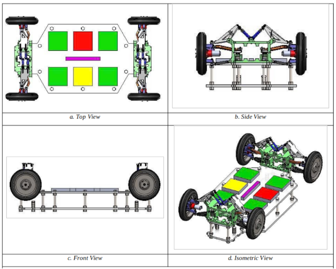

# 4x4 Wheel Controller in Training Model

  <video src="https://github.com/user-attachments/assets/7e0d2c64-697f-4408-bdc2-077278d0eeaf" controls width="480"></video>

## Table of Contents

| Section | Description |
|---|---|
| [1. Introduction](#1-introduction) | 4x4 Vehicle platform and wheel controller module overview. |
| [2. General Layout](#2-general-layout) |- Hardware. - Software. |
| [3. Coding Rules](#3-coding-rules) | Define coding rules of the project. |

## 1. Introduction

This repository contains the high-performance embedded firmware designed for a distributed **4x4 Training Model Vehicle** platform. Featuring 4-Wheel Drive and 4-Wheel Steering (4WD/4WS) capabilities, this autonomous robotic platform allows independent torque and steering angle adjustments at each individual wheel assembly to achieve precise vector kinematics tracking.

This project was actively researched, developed, and validated within the **BOSCH Lab at Ho Chi Minh City University of Technology (HCMUT)** as a graduation thesis project. The primary engineering goal is to model, implement, and benchmark a rugged, real-time distributed automotive software architecture that complies with industrial embedded software production quality. 

This specific repository hosts the complete source code, bare-metal peripheral drivers, and real-time scheduling logic for the **Wheel Controller Module**—the localized intelligent edge node deployed at each of the four wheel configurations.

  
  
<b><em>Figure 1:</em></b> Hardware General Layout of the Distributed System

## 2. General Layout

### 2.1. Hardware

### 2.2. Software

## 3. Coding Rules
